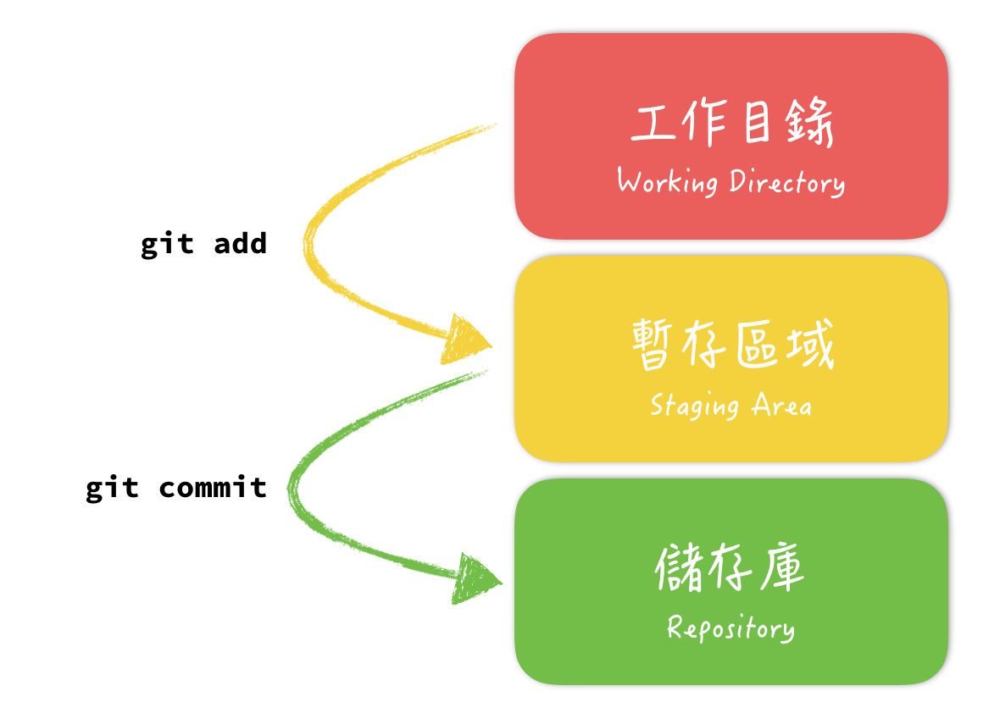

# Note: Learning Git for yourself

## User Configuration
### Command Settings
```
$ git config --global user.name "NAME"
$ git config --global user.email "EMAIL"
```
### Settings List
```
$ git config --list
```
### Setting File Path
```
~/.gitconfig
```
### Setting Different Users
```
$ git config --local user.name "LOCAL"
$ git config --local user.email "LOCAL"
```

## Convenient Settings
### Changing Default Editor
```
$ git config --global core.editor emacs
```

### Git Command Abbreviations
```
$ git config --global alias.co checkout
$ git config --global alias.br branch
$ git config --global alias.st status
$ git config --global alias.l "log --oneline --graph"
$ git config --global alias.ls 'log --graph --pretty=format:"%h <%an> %ar %s"'
```

## Creating and Initialising Repository
```
$ git init
```
## Passing Control to  Git
```
$ git status
$ git add .
$ git commit -m "init commit"
```

### Allowing Commit Empty
```
$ git commit --allow-empty -m "Empty"
```

## Working Directory, Staging Area and Repository 
|Working Directory|Staging Area|Repository|
|:-:|:-:|:-:|
|git add|git commit||

### Fig.



## View Log
```
$ git log
$ git log --oneline --graph
```

### Advanced Commands
#### Querying Someone's Commit
```
$ git log --oneline --author="NAME"
```
#### Querying Keywords from Commit Message
```
$ git log --oneline --grep="MESSAGE"
```
#### Querying Keywords from Commit Files
```
$ git log --oneline -S "KEYWORD"
```

#### Querying Commit by Date or Time
```
$ git log --oneline --since="9am" --until="12am" --after="2017-01"
```

## Delete or Rename Files
```
$ rm FILE && git add . 
# == $ git rm FILE

$ mv FILE && git add . 
# == $ git mv FILE
```

## Modifiying Commit Records
```
$ git commit -amend -m "REPLACE_MESSAGE"
```

## Adding Files to Previous Commit
```
$ git commit --amend --no-edit
```

## Removing Files from Git
```
$ git rm --cached FILE
```

## Ignoring Specific Files
```
.gitignore
```

## Checking Files' Modification from Every Commits
```
$ git log -p FILE
```

## Checking Files' Editor
```
$ git blame
```

## Rescuing Files from Staging Area
```
$ git checkout FILE
$ git checkout .
```

## Reseting Commits
```
$ git reset HEAD^
$ git reset master^
4 git reset HEAD~1
```

### Git Reset Modes
```
$ git reset --mixed
$ git reset --soft
$ git reset --hard
```
Modes |mixed mode|soft mode|hard mode
:-|:-:|:-:|:-:|
Working Directory|Keep|Keep|Abort
Staging Area|Abort|Keep|Abort

---

Modes|mixed mode（default）|soft mode |hard mode
:-|:-:|:-:|:-:|
Files from Commit | to Working Directory|to Staging Area| Abort

## Querying All Log
```
$ git reflog
$ git log --oneline -g
```

## HEAD is a branch where we are now
```
$ cat .git/HEAD
```

## Git Branchs
```
$ git branch
```

### Creat Branchs
```
$ git branch cat
```

### Rename Branchs
```
$ git branch -m cat tiger
```

### Delete Branchs
```
$ git branch -d dog
```

#### Force Delete Branchs
```
$ git banch -D dog
```

### Switch Branchs
```
$ git checkout tiger
```

#### Switch and Create New Branchs
```
$ git checkout -b god
```

## Merge Branchs
```
$ git merge cat
$ git merge cat --no-ff
```

## Modifiy Histories
```
$ git rebase BRANCH
$ git rebase -i COMMIT
```

## Stash
```
$ git stash
$ git stash list
$ git stash pop
```

## Push to Remote Side
```
$ git remote add origin URL
$ git push -u origin master
```

## Generate ssh key
```
$ ssh-keygen
$ cat ~/.ssh/id_rsa.pub
$ pbcopy < ~/.ssh/id_rsa.pub
